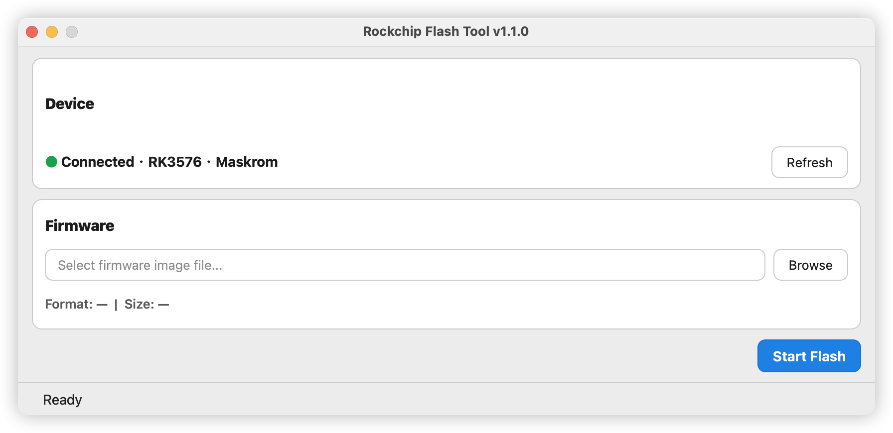
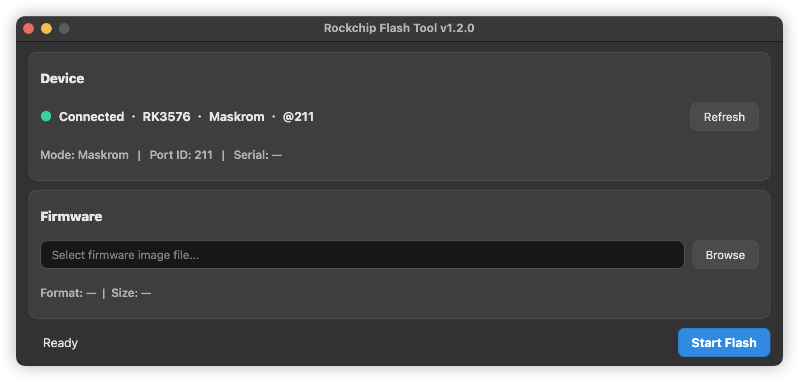

# Rockchip Flash Tool

[](https://github.com/evtest-hash/rockchip-flash-tool/actions/workflows/build-release.yml)
[](https://github.com/evtest-hash/rockchip-flash-tool/releases/latest)


选好固件，点 **Start Flash**，两步烧完一块 Rockchip 板子。
接的是哪颗芯片、板子在什么模式、该用哪个 loader、镜像怎么写，工具自己判断。

[English](README.md) · [简体中文](README.zh-CN.md)





## 下载

| 平台 | 文件 | 说明 |
|---|---|---|
| macOS 11+ | [Rockchip-Flash-Tool-macOS-universal.dmg](https://github.com/evtest-hash/rockchip-flash-tool/releases/latest/download/Rockchip-Flash-Tool-macOS-universal.dmg) | 通用版，Apple 芯片和 Intel 都能跑 |
| Windows 10/11 | [Rockchip-Flash-Tool-windows-x64.zip](https://github.com/evtest-hash/rockchip-flash-tool/releases/latest/download/Rockchip-Flash-Tool-windows-x64.zip) | 首次运行会自动装 Rockchip USB 驱动 |
| Linux x86_64 | [Rockchip-Flash-Tool-linux-x86_64.AppImage](https://github.com/evtest-hash/rockchip-flash-tool/releases/latest/download/Rockchip-Flash-Tool-linux-x86_64.AppImage) | 需要 FUSE2，见下文 |

每个版本发布前，都会在三个平台上分别构建、各自跑一遍冒烟测试。
[全部版本 →](https://github.com/evtest-hash/rockchip-flash-tool/releases)

## 安装说明

### macOS：提示"身份不明开发者/无法验证开发者"

安装后如果被系统拦截：

1. 在 Finder 中右键应用，选择 **打开**。
2. 在弹窗中再次点击 **打开**。

还是打不开，就到 **系统设置 → 隐私与安全性**，在安全提示区域找到被拦截的应用，点 **仍要打开**。

如果是隔离属性导致的，执行：

```bash
xattr -dr com.apple.quarantine "/Applications/Rockchip Flash Tool.app"
```

### Linux：AppImage 依赖 FUSE2

首次运行 AppImage 可能提示缺少 FUSE，装上 FUSE2 运行时即可：

| 发行版 | 命令 |
|---|---|
| Ubuntu / Debian（≤ 22.04） | `sudo apt install libfuse2` |
| Ubuntu 24.04+ | `sudo apt install libfuse2t64` |
| Fedora | `sudo dnf install fuse-libs` |
| Arch Linux | `sudo pacman -S fuse2` |
| openSUSE | `sudo zypper install libfuse2` |

装不了 FUSE2 的话，用解包模式跑：

```bash
APPIMAGE_EXTRACT_AND_RUN=1 ./Rockchip-Flash-Tool-linux-x86_64.AppImage
```

## 为什么做这个工具

Rockchip 烧录没有一套通用流程。芯片型号不一样，板子进的模式不一样，镜像格式不一样，操作系统还不一样，条件一变步骤就得跟着变，往往连工具都得换一个。

这些差异由工具内部消化，不往外抛给操作员：

- **三个平台一套流程。** 同一个窗口，同样两步。
- **少判断，少出错。** 芯片型号、当前模式、镜像格式都是自动识别，不用人选。
- **新人上手快。** 不懂底层烧录机制也能烧对。

实验室、产线、现场都能直接用。

## 许可

[Apache-2.0](LICENSE)。

发布包里还带了 Qt 运行时（LGPL-3.0）和 Rockchip 预编译的二进制，它们沿用各自原本的授权条款，详见 [THIRD_PARTY.md](THIRD_PARTY.md)。
